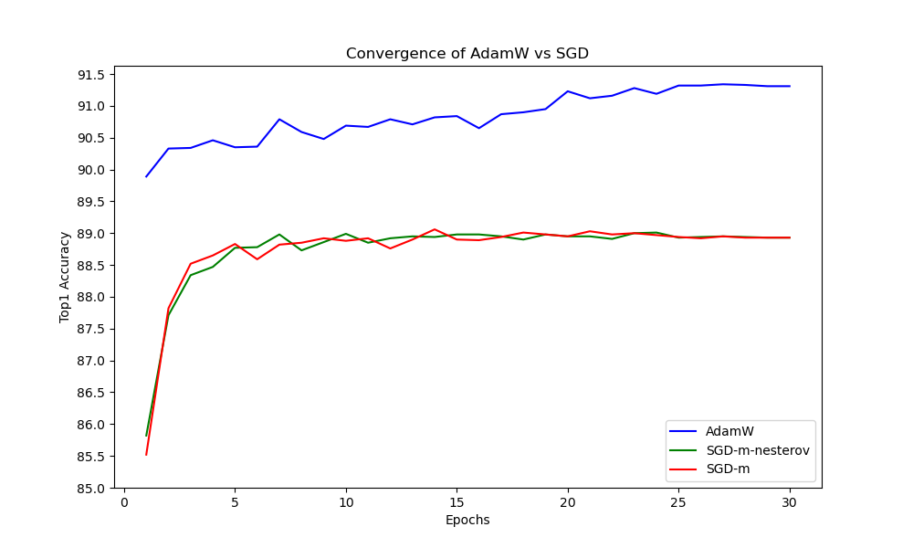
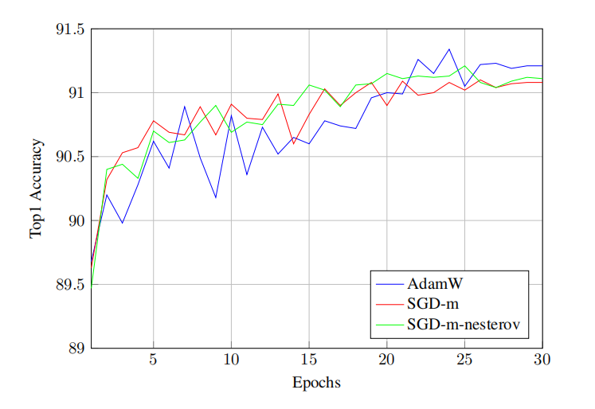

# DL-intro-3

## 董宇坤 PB21000237

论文对应仓库地址：https://github.com/ehuynh1106/TinyImageNet-Transformers

https://paperswithcode.com/paper/vision-transformers-in-2022-an-update-on-tiny

注：transformers被翻成“转换器”，和Google的那个有很大相似之处。

## 摘要全文翻译

近期的图像转换器技术有了重大进步，并在一定程度上缩小了与传统CNN架构之间的差距。标准的处理流程是先在像ImageNet-21k这样的大型数据集上进行训练，然后再在ImageNet-1k上进行微调。微调之后，研究者们通常会考虑在像CIFAR-10/100这样的小型数据集上进行迁移学习的性能，但往往会忽略Tiny ImageNet数据集。本文为视觉转换器在Tiny ImageNet上的性能提供了更新。包括了视觉转换器（Vision Transformer，ViT），数据高效图像转换器（Data Effificient Image Transformer，DeiT），图像转换器中的类别注意力（ Class Attention in Image Transformer，CaiT）以及Swin转换器（Swin Transformers）。此外，Swin转换器以91.35%的验证准确率超越了当前的最优结果。代码可在此处获取：https://github.com/ehuynh1106/TinyImageNet-Transformers

## Introduction全文翻译

ViT论文（Dosovitskiy等人，2020年）展示了可以将转换器应用于图像分类任务。然而，ViT是在JFT-300M数据集（Sun等人，2017年）上预训练的，这是Google的内部数据集，包含了3亿张图片。因此，训练效率和数据可用性的问题就显而易见了。DeiT（Touvron等人，2020年）对此做出了回应，表明了缓解 Transformer 数据匮乏性质的一种方法是通过严格的训练流程和知识蒸馏（knowledge distillation）。因此，可以使用ImageNet-21k（Ridnik等人，2021年）来训练视觉转换器，并在ImageNet-1k（Russakovsky等人，2014年）上进一步微调。像CaiT（Touvron等人，2021年）和Swin（Liu等人，2021b年）等后续的图像转换器，都紧密遵循了DeiT所制定的蓝图。

除了ImageNet-1k，这些研究还在CIFAR-10和CIFAR-100（Krizhevsky，2009年）上进行迁移学习测试。然而，每一篇论文都没有包含Tiny ImageNet（Le & Yang，2015年）。Tiny ImageNet是ImageNet-1k的一个子集，包含了100000张图片和200个类别，最初在斯坦福大学的一个计算机视觉课程中被介绍出来。自从它的诞生以来，很少有论文在他们的基准测试中使用这个数据集。

也就是说，Lee等人（2021年）做过一项研究，他们提出了修改视觉转换器的方法，以提高在Tiny ImageNet上从零开始训练的准确性。但实际上，当涉及到准确性时，迁移学习是一种更常见且更强大的技术。因此，没有现代研究对Tiny ImageNet上的视觉转换器进行评估。本文将填补这个空白，并报告使用与DeiT类似的训练制度的ViT，DeiT，CaiT，和Swin转换器的准确性。

## 复现

- **复现什么？**

首先我来简要讲讲这论文讲了什么。论文较短，内容专注于tiny-imagenet一个数据集上。作者的主要工作在于，在四种visual transformer ViT，DeiT，CaiT，和Swin上分别作了训练与测试；探究使得训练效果最好的技术配置，此即消融实验（ablation test）的部分。ablation study使作者找到了他所认为的训练最佳配置，因此，训练并检验四种visual transformer的表现是论文的主体部分。本次复现不会针对ablation study，而是**着手于训练并且验证这四种模型，给出量化的评估**。

（第二次更新报告）在发现自己的操作愈发娴熟的情况下，我决定对于后面作者**对optimizer的实验（adam/sgd）以及部分消融实验进行复刻**。

- **复现结果**

#### 基本的四个模型复现

在训练精度上，我的训练结果与论文的结果高度相近，可以说是高度复现了。具体的实验截图见我的仓库，或者是附件。

| 模型名称                        | 论文的acc@1 | 复现的acc@1 | 复现的acc@5 |
| ------------------------------- | ----------- | ----------- | ----------- |
| ViT-L                           | 86.43       | **86.52**   | 95.82       |
| CaiT-S36                        | 86.74       | 86.66       | 96.61       |
| DeiT-B distilled(batch_size=64) | 87.29       | 82.52       | 94.16       |
| Swin-L(两次实验取最高)          | 91.35       | 91.32       | 98.04       |

不过这次复现也有明显的缺憾的地方。DeiT模型的准确率不够理想，怀疑是训练进程多次中断，断断续续调出来而导致的。也有可能是，消融实验得到的一些最优参数和最优方法的选择不一定适用于所有的模型。注意到此时模型DeiT使用的batch size为64，因此我又换了batch size重新实验，这一部分并非论文内容，是自己实验内容。得到以下结果：

| 模型名称                         | 论文的acc@1 | 复现的acc@1 | 复现的acc@5 |
| -------------------------------- | ----------- | ----------- | ----------- |
| DeiT-B distilled(batch_size=32)  | -           | 81.79       | 93.84       |
| DeiT-B distilled(batch_size=64)  | 87.29       | 82.05       | 94.02       |
| DeiT-B distilled(batch_size=128) | -           | 82.11       | 93.91       |

我们看出，在batch size=64的情况下，两次训练结果相近，并且在原代码的基础上，并没有做原理上的改动。猜测导致复现效果不好的原因在于，DeiT模型作为全文提及次数最多的模型，其实现的手段各种细节肯定会对准确性造成影响。然而我查遍了源代码后发现命令行中的命令只会改变batch size和预训练模型的选取。换言之，ablation study确定的一些配置是全局适用，并不一定最适合于DeiT模型。但是就其他模型训练的效果跟论文近乎一致来看，这个结果多少还是让我感到一些不解。

此外，我们看到，batch size对于结果的影响并不大，多次试验表明，在这个模型的基础上跑出来的DeiT模型准确率大概在82%左右，与原文提及的87.29%有较大差距。其余的模型复现与原文吻合的非常好。

在模型的性质上面，给出一些粗略的比对（下图中均用rtx3090_old运行）：

| Model       | (论文)#params |  (论文)FLOPs | (复现)模型占用内存 | (复现)每个epoch耗时 |
| ----------- | ------ | ----- | ------- | ------- |
| ViT-L/16    |    304M | 190.7B | 1.13GB | 22:56 |
| CaiT-S/36   |     68M |  48.0B | 781MB | 23:10 |
| DeiT-B/16-D |     87M |  55.5B | 330MB | 9:20 |
| Swin-L/4    |    196M | 103.9B | 761MB | 20:30 |

我们看到，虽然CaiT模型参数个数和浮点运算次数较少，但是它训练用时是最长的，这一点也和原文的表述一致。再者，虽然DeiT模型的复现准确率不尽人意，但是它具有轻量化的优势以及训练快的特点。此外，原文也提及，CaiT和 Swin等后续的图像转换器， 都紧密遵循了DeiT所制定的蓝图，可见DeiT相关工作的重要性。ViT是在 JFT-300M 数据集上预训练的， 这是 Google 的内部数据集， 包含了 3 亿张图片，因此它对应的模型占用的空间是最大的。

#### 优化器选取的实验复现

复现了AdamW和SGD with nesterov momentum以及SGD without nesterov momentum三种情况,acc@1随epoch的变化图表如下（前后两张分别是我的结果和作者的结果）:





这里的复现和原作者是有出入的。复现结果显示，AdamW优化器的训练精度高开高走，而且变化平稳，并没有表现出论文中的较大波动。对于SGD优化器，复现结果显示其表现不如前者，有无nesterov动量对最后的收敛性影响不大，且收敛比AdamW更快，这两点与原文保持一致。造成这种差别的原因我猜测一定程度上和我运行的配置有关。

#### 部分消融实验的复现

我选取了消融实验中相对容易实现的变量进行控制（简单的命令行的变化），得到的结果如下（“-”代表这个实验原文做了，但是我并没有做）：

| **Change** | **(my)Accuracy** | **(paper)Accuracy** |
| --- | --- | --- |
| Default(no RandAugment) | 91.32 | 91.35 |
| Add RandAugment | 91.01 | 91.34 |
| Remove Rand-Erasing | 91.03 | 91.28 |
| Add Simple Random Crop | - | 91.26 |
| Remove Stochastic Depth | - | 91.25 |
| Remove Label Smoothing | 91.20 | 91.25 |
| Replace RA with AutoAugment | - | 91.25 |
| Remove Mixup | 91.14 | 91.11 |
| Add Random Resized Crop | - | 91.06 |
| Remove CutMix | 91.28 | 91.04 |
| Add Model EMA | - | 90.83 |

我们可以看到，原文中的Add RandAugment或有或无影响其实不大，这里我的结果一定程度上说明了Add RandAugment对结果产生了更大的影响，或许比原文更有说服力一些。从我的实验中，得到的定性结论与原文基本一致：RandAugment的移除会一定程度增加accuracy；CutMix，Mixup的裁剪手段和Label Smoothing、Rand-Erasing都会或多或少提高模型的精准性，因此作者将这些纳入了训练的默认配置中。不过，在去除CutMix的情形，我复现的结果敏感性较低，而在添加RandAugment和Rand-Erasing这一选项上，我复现的版本反映出来的变化更大。

- **遇到的问题&代码上的修改&复现的细节**

1. 本地运行太慢，各种离奇报错

每次运行都会有长串报错，怀疑是PIL，pytorch版本问题，warnings很多。最主要的是一个epoch动辄50分钟，电脑根本撑不了10个epochs。此外，限于配置，batch size被我在代码里加了一个削减倍数，一般要削减至少4倍才能跑起来。因此转到bitahub上运行。

2. bitahub上由于操作不熟以及上传文件大小限制，各种遇到的问题罗列如下：

- 3090的卡难以申请到，以至于初期的项目进行的很慢。后面使用了3090old，这个就不拥挤了。

- 不知道输出要放在专门的output文件夹里，吃大亏，四个进程白跑几个小时。后面对`main.py`里面引入了Python内置库`shutil`，在`torch.save()`后面加入了`shutil.copyfile()`代码才成功在output文件夹里看到输出。

- 数据集被预先处理成.pkl文件的形式，打包之后大小多于1G，后面试过ssh+git bash，后面熟练使用了xshell+sftp传输大文件。

- 不止一次因为找不到某特定文件夹位置而中断程序。原因是该文件夹虽然存在于代码区，但是运行任务的时候若该文件夹为空，代码快照里面便不会出现相应的文件夹。在空文件夹中放入一个文件即解决问题。

- `fileio.py`里面出现了`labels_str = [f.name for f in os.scandir('train') if f.is_dir()]`字段，意味着训练时计算精度时，还需要train文件夹出现在代码区，这是不可能的，因为代码区文件多于200M无法运行任务。解决方法是暴力解决：

  ```python
  labels_str = ['n01443537', 'n01629819', 'n01641577', 'n01644900'， 
  				...
  			  'n01698640', 'n01742172','n09428293', 'n12267677']
  ```

- 在训练DeiT的时候，出现大量别的模型没有的报错。

  AttributeError: 'tuple' object has no attribute 'log_softmax'：先尝试换pytorch版本至2.0.0，因为在电脑上训练可以跑起来。但是出现了新的报错，最后的解决办法是，根据traceback跟踪到`engine.py`，找到里面的报错字段`pred = model(x)`将其修改成`pred， _ = model(x)`便解决了问题。还有别的报错不一一解释。

- 平均下来，每个模型30个epoch，遇到的问题各不相同，不过在训练CaiT和ViT遇到的错误和进程差不多同步。每个模型的训练平均被打断2-3次，好在每个epoch我都有存档，再用xshell上传到自建数据集里从最新的断点继续训练即可，不过数据传来传去很消耗时间和内存。总的来看，对于这四个模型，每个模型消耗的总时间在30h左右，而后面工序成熟以后，训练deit模型（rtx3090）可以不经任何打断地完成训练，耗时约五个半小时，推得对于其他三个模型，30个epochs的净训练时长在11-12h。

## 总结

在四个模型的表现上，复现结果几乎与原论文一致。我们也可以看到，Swin转换器在准确性上表现良好，而DeiT模型虽然精确度不如前者，但是凭借其快接近一倍的训练速度，和很小的存储空间的特性，仍然具有很大的潜力。上述结论也与原论文一致。第一次复现论文，虽然困难重重，但所幸最终修成正果。

很感谢老师提供的算力。在此基础上我还完成了一个GPT-2模型的训练，这个项目在我的电脑上肯定是跑不起来的。在bitahub上捣腾的时间确实很久，遇到的bug也很多，好在最终适应了，训练后面几个模型效率就高多了。此外我还学到了有关bash，sftp，ssh等非计算机专业同学很少接触的东西，自己动手解决bug的自信也变强了。同时，我也很高兴自己与AI为伴。如果没有ChatGPT，我花在做ppt和写报告上的时间要长很多。

最后，感谢老师和助教一个学期以来的付出。这门课（虽然很累）让我有很大的收获。谢谢。
